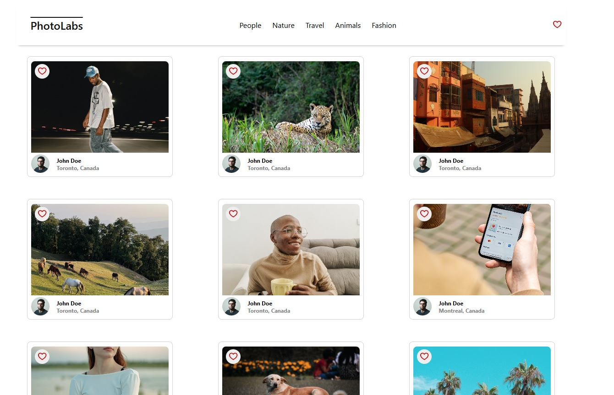
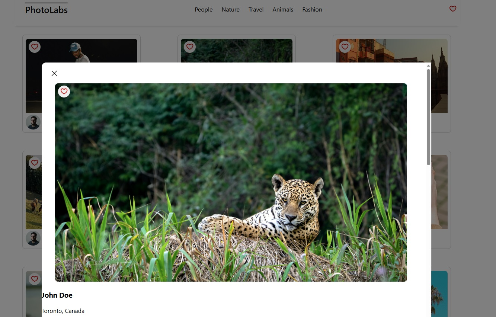

# Photolabs

PhotoLabs is a React-based photo-sharing application that allows users to browse, like, and view details of various photos. This project was developed as part of the Web Development React course.

View a collection of photos.
Display selected photo in a modal with detailed information.
Like/Unlike photos.

Screenshots
Homepage View

Photo Modal View

## Setup

[Backend Setup Instructions](/backend/)
Start the server with:
npm start

Refer to backend/readme for further details.

[Frontend Setup Instructions](/frontend/)
Start the server with:
npm run dev

Refer to frontend/readme for further details.